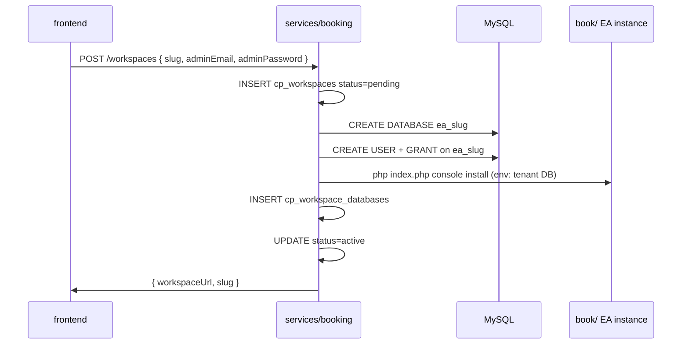

# Control Plane Database Schema — ThesiBook Booking

Separate from Easy!Appointments tenant databases. One MySQL instance can host `thesibook_control` plus many `ea_{slug}` databases.

## Tables

### `cp_users`

Platform accounts (register on Next.js frontend).

| Column | Type | Notes |
|--------|------|-------|
| id | BIGINT UNSIGNED PK AI | |
| email | VARCHAR(255) UNIQUE | |
| password_hash | VARCHAR(255) | bcrypt/argon2 |
| name | VARCHAR(255) | |
| created_at | TIMESTAMP | |
| updated_at | TIMESTAMP | |

### `cp_workspaces`

One row per booking tenant (maps to one EA database).

| Column | Type | Notes |
|--------|------|-------|
| id | BIGINT UNSIGNED PK AI | |
| slug | VARCHAR(63) UNIQUE | subdomain: `{slug}.book.domain` |
| display_name | VARCHAR(255) | |
| status | ENUM | pending, provisioning, active, suspended, deleted |
| owner_user_id | BIGINT UNSIGNED FK → cp_users | |
| ea_base_url | VARCHAR(512) | e.g. https://acme.book.domain.com |
| created_at | TIMESTAMP | |
| updated_at | TIMESTAMP | |

### `cp_workspace_databases`

Encrypted credentials for tenant EA MySQL database.

| Column | Type | Notes |
|--------|------|-------|
| id | BIGINT UNSIGNED PK AI | |
| workspace_id | BIGINT UNSIGNED UNIQUE FK | |
| db_host | VARCHAR(255) | usually localhost |
| db_name | VARCHAR(64) | `ea_{slug}` |
| db_user | VARCHAR(64) | dedicated user per tenant |
| db_password_enc | TEXT | AES-256-GCM or server KMS |
| created_at | TIMESTAMP | |

### `cp_workspace_members`

Optional: invite additional admins to a workspace (platform level, not EA roles).

| Column | Type | Notes |
|--------|------|-------|
| workspace_id | BIGINT UNSIGNED FK | |
| user_id | BIGINT UNSIGNED FK | |
| role | ENUM | owner, admin, member |
| PRIMARY KEY (workspace_id, user_id) | | |

### `cp_provisioning_jobs`

Audit + retry provisioning.

| Column | Type | Notes |
|--------|------|-------|
| id | BIGINT UNSIGNED PK AI | |
| workspace_id | BIGINT UNSIGNED FK | |
| step | VARCHAR(64) | create_db, migrate, seed_admin, activate |
| status | ENUM | queued, running, done, failed |
| error_message | TEXT NULL | |
| created_at | TIMESTAMP | |
| finished_at | TIMESTAMP NULL | |

## Provisioning sequence



## API (MVP)

| Method | Path | Auth |
|--------|------|------|
| POST | `/api/workspaces` | Platform user JWT/session |
| GET | `/api/workspaces/:slug` | Owner or member |
| GET | `/api/workspaces/mine` | Platform user |

Request body `POST /api/workspaces`:

```json
{
  "slug": "acme-salon",
  "displayName": "Acme Salon",
  "adminEmail": "owner@acme.test",
  "adminPassword": "..."
}
```

## EA per tenant

- Database name: `ea_{slug}` (slug normalized: lowercase, `[a-z0-9-]`)
- DB user: `ea_{slug}` with GRANT only on that database
- EA `config.php` generated per request via env vars (future B5) or per-tenant config file on disk (interim)

## Implementation location

```txt
services/booking/
  sql/001_control_plane.sql
  src/              # Node/TS API (recommended)
  scripts/provision-tenant.sh   # shell fallback calling mysql + EA CLI
```

WordPress and EA admin users remain **separate** — link by `workspace_id` + `slug` only.
